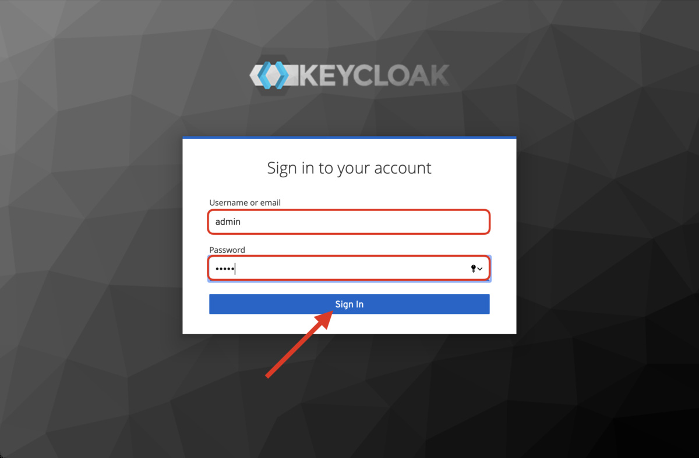
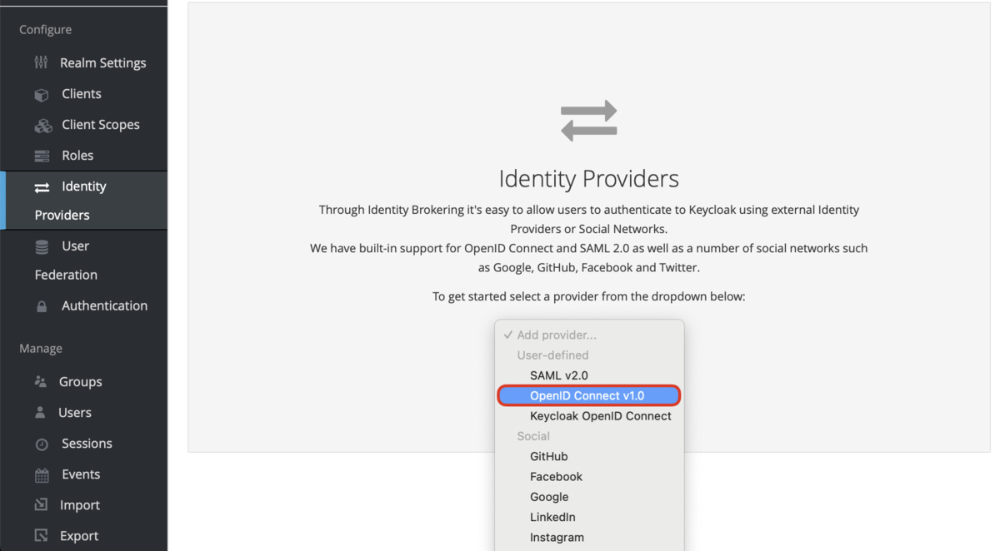
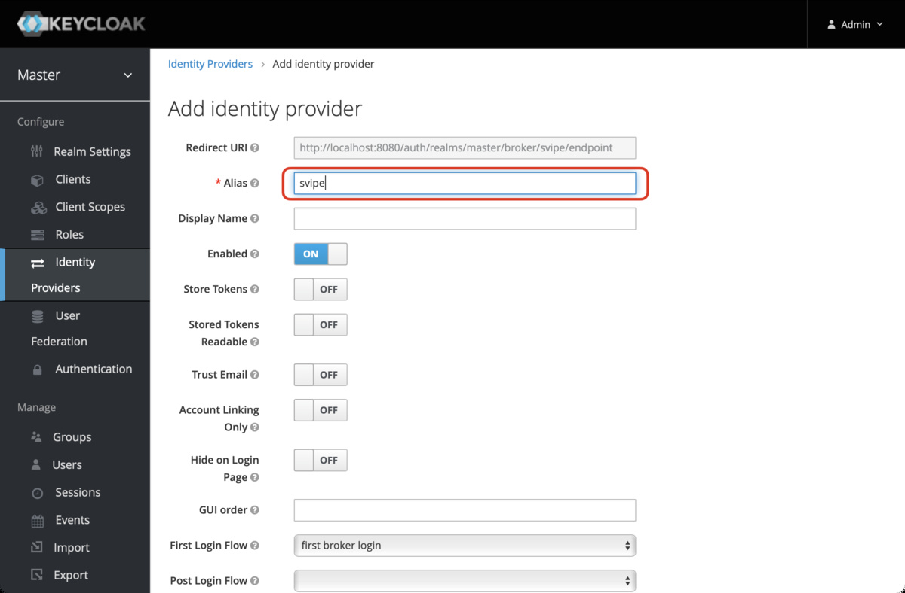
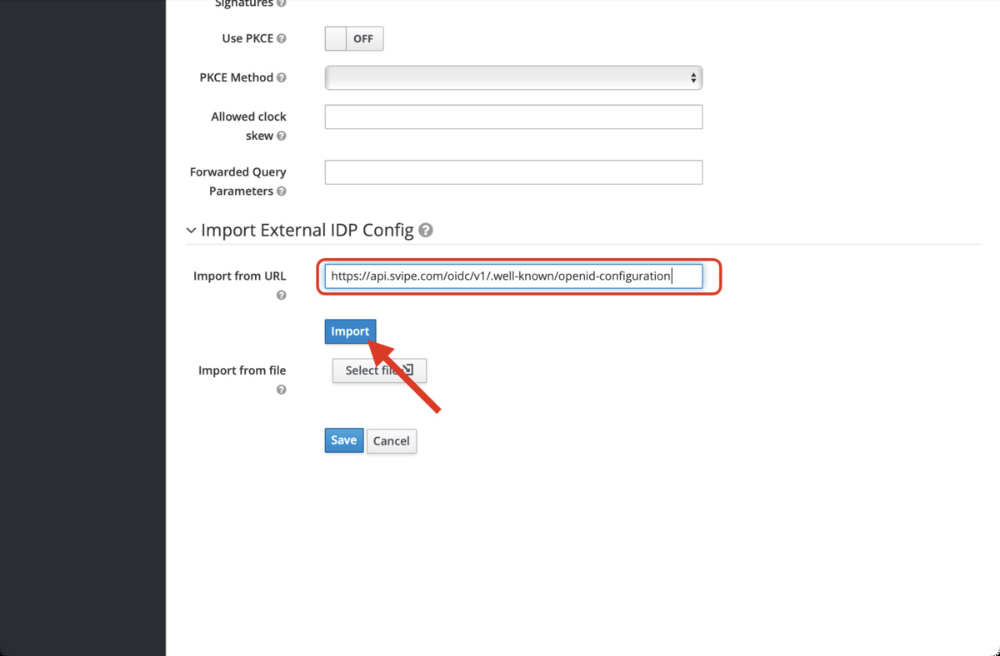
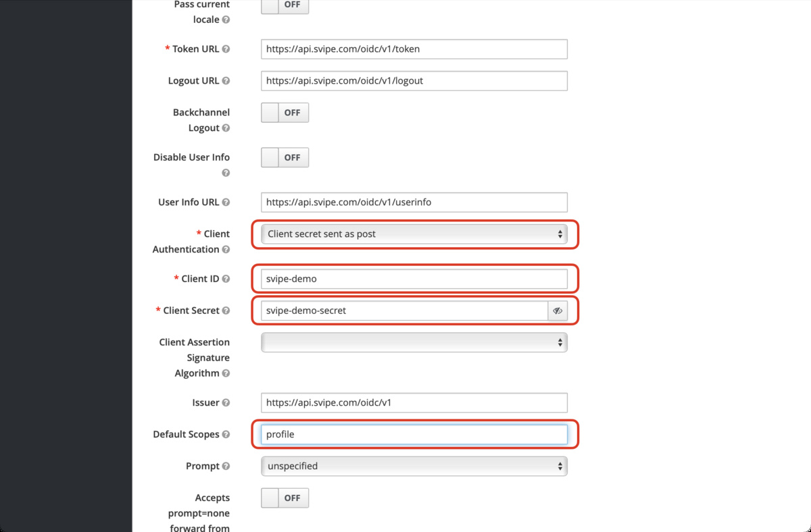
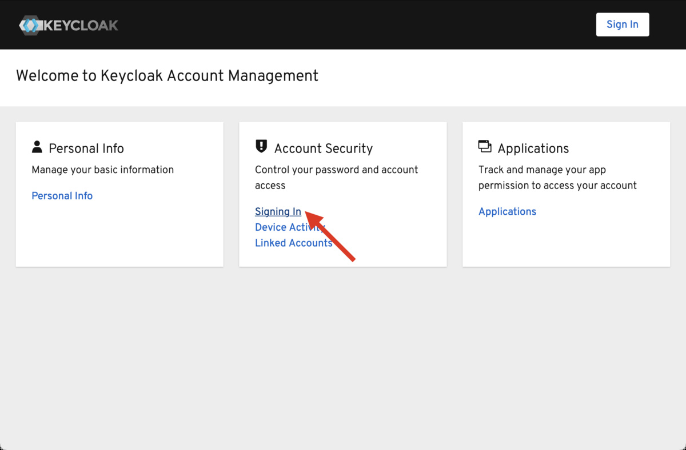
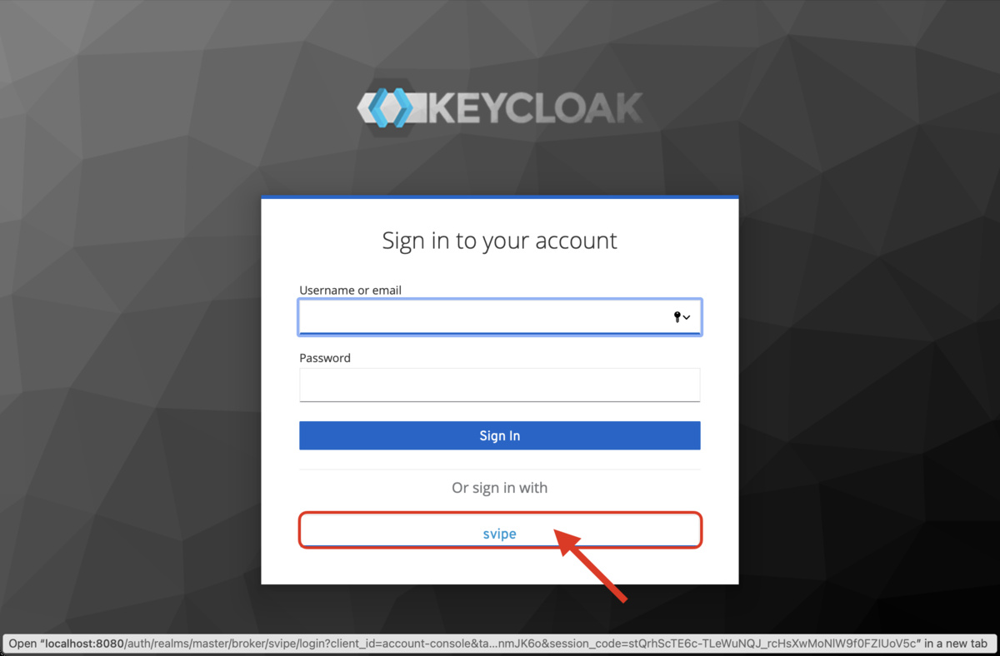
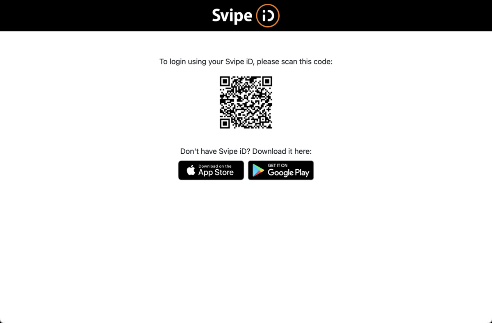
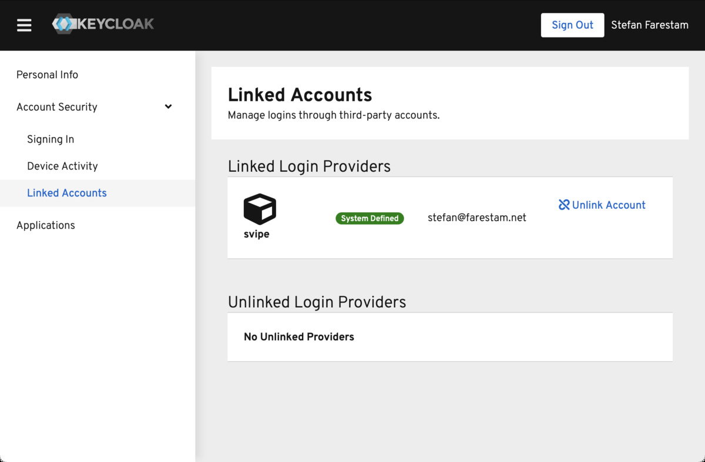

## Keycloak  <!-- {docsify-ignore} -->

[Keycloak](https://www.keycloak.org) is an open source identity and access management solution that supports external identity providers using OIDC.

To configure Svipe iD as an identity provider for Keycloak, first start by launching a local docker instance of keycloak:

    docker run -p 8080:8080 -e KEYCLOAK_USER=admin -e KEYCLOAK_PASSWORD=admin quay.io/keycloak/keycloak:13.0.1

Then launch a browser, navigate to http://localhost:8080/auth/admin and login with the credentials:

    Username:   admin
    Password:   admin

Select `Identity Providers` in the left side menu and create a new `OpenID Connect v1.0` Identity provider:

Give the new identity provider the alias name `Svipe`:

and import the settings from:

    {{ oidc_root }}/.well-known/openid-configuration

then configure:

    Client Authentication:  Client secret sent as post
    Default Scopes:         profile

and enter your application credentials (or the demo credentials) as values for `Client ID` and `Client Secret`. Finally click `Save` to save your settings and you're done configuring Svipe iD as an identity provider.

Now, try to login with Svipe iD as a regular user by navigating to http://localhost:8080/auth/realms/master/account/ and click on `Signing In`:

then select `sign in with Svipe`:

Launch the Svipe iD app, click on `Scan QR` and scan the Qr code on the login page:

and you should be logged in:

