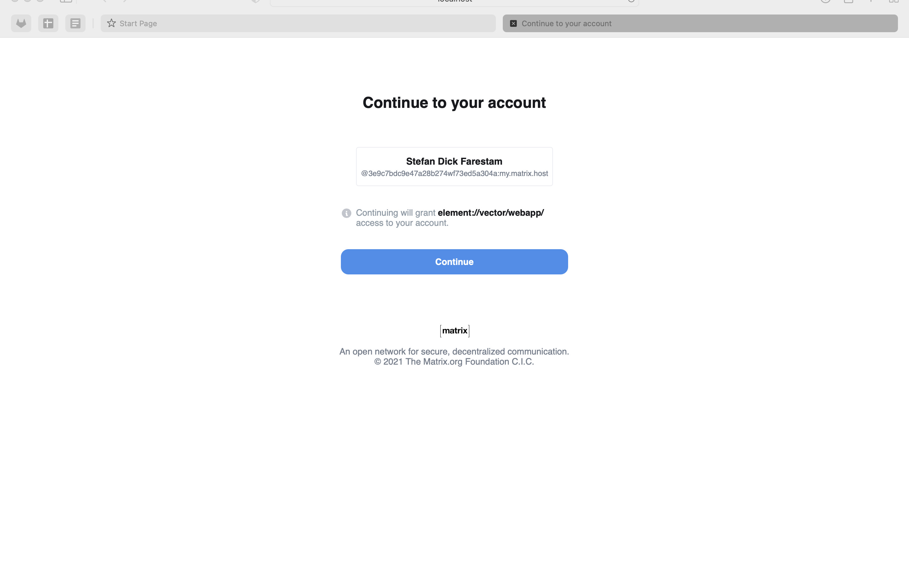

## Matrix   <!-- {docsify-ignore} -->

Matrix is an open network for secure, decentralized communication. Check out [matrix.org](https://matrix.org) for more information.

## Setting up the Matrix server

Prepare a directory for the configuration file:

    mkdir -p synapse-data

Generate the configuration file:

    docker run -it --rm \
        -v $PWD/synapse-data:/data \
        -e SYNAPSE_SERVER_NAME=my.matrix.host \
        -e SYNAPSE_REPORT_STATS=yes \
        matrixdotorg/synapse:latest generate

Define the matrix server url (assuming that you want the matrix server to be accessible from localhost, otherwise change to the ip or hostname of your server):

    server_url="http://localhost:8008/"

Add the local configuration with the Svipe oidc demo credentials to the synapse configuration file:

    cat << ---END >> synapse-data/homeserver.yaml

    public_baseurl: $server_url

    oidc_providers:
      - idp_id:    svipe_idp
        idp_name:  "Svipe iD"
        discover:  true
        issuer:   "{{ oidc_root }}"
        client_id:      "svipe-demo"
        client_secret:  "svipe-demo-secret"
        scopes: ["openid", "profile"]
        user_mapping_provider:
          config:
            localpart_template:     "{{ user.svipeid }}"
            display_name_template:  "{{ user.name }}"
    ---END

Then start the server (add the `-d` option in case you want to run it in the background, but run the first tie without as it will make it easy to detect any configuration error):

    docker run --name synapse \
        -v $PWD/synapse-data:/data \
        -p 8008:8008 \
        matrixdotorg/synapse:latest

...and that's it!

## Login with Svipe iD from a client

There are a many clients available for Matrix, both for desktop and mobile. Here's an [overview](https://matrix.org/clients/) of available options. We'll showcase the integration with the Element desktop client, which you can download from [here](https://element.io/get-started#download)

Start by launching the Element desktop app:

Click on `Sign in`:

Select `Other homeserver` and enter the url of the homeserver that you defined when you configured the Matrix server:

You should now return to the login screen and have the option `Continue with Svipe iD` visible at the bottom. Click on it to start a login with Svipe iD:

Time to bring up the Svipe iD app, scan the QR code and approve the login:

The matrix server will then ask you to confirm the account. Click on `Continue`:

and you're logged in to Element!

