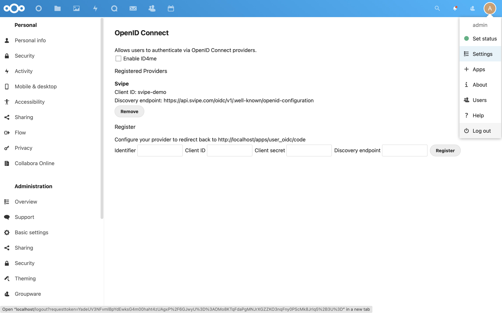

## Nextcloud  <!-- {docsify-ignore} -->

[Nextcloud](https://nextcloud.com) is a suite of client-server software for creating and using file hosting services. Being free and open-source software, anyone is allowed to install and operate it on their own private server devices. Nextcloud is functionally similar to Dropbox, Office 365 or Google Drive when used with its integrated office suite solutions Collabora Online or OnlyOffice.

To try this integration, start by launching an instance of nextcloud locally

    docker run -p 80:80 nextcloud

Then launch a browser to `http://localhost` where you start with creating an account for `admin` and click `Finish setup`.

When logged in, click on the user icon in the top, right corner and select `+ Apps`:

Select `Social and communication` in the left-side menu:

Locate the app `OpenID Connect user backend` and click on `Download and enable`:

Then open the user menu again in the top right corner and select `Settings`:

Locate `OpenID Connect` in the left-side menu:

Now configure the OpenID Connect app with:

    Identifier:         Svipe
    Client ID:          svipe-demo
    Client secret:      svipe-demo-secret
    Discovery endpoint: {{ oidc_root }}/.well-known/openid-configuration

and click `Register`:

the select `Log out` in the user menu:

Now the login screen has a new option `Login with Svipe`. Click on that!

Time to bring up the Svipe iD app, scan the QR code and approve the login:

and you're logged in to Nextcloud:

