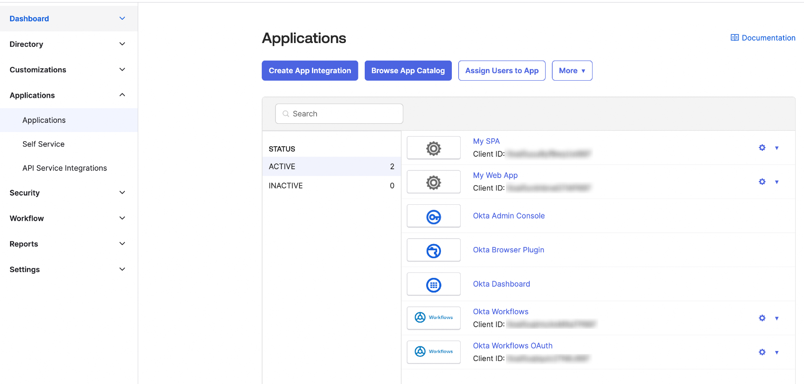
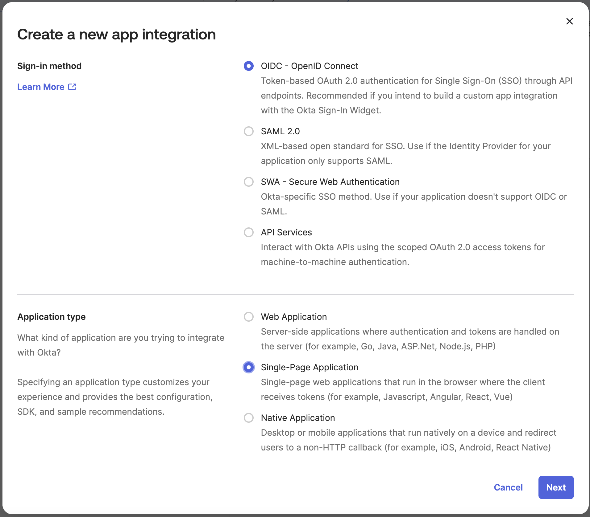
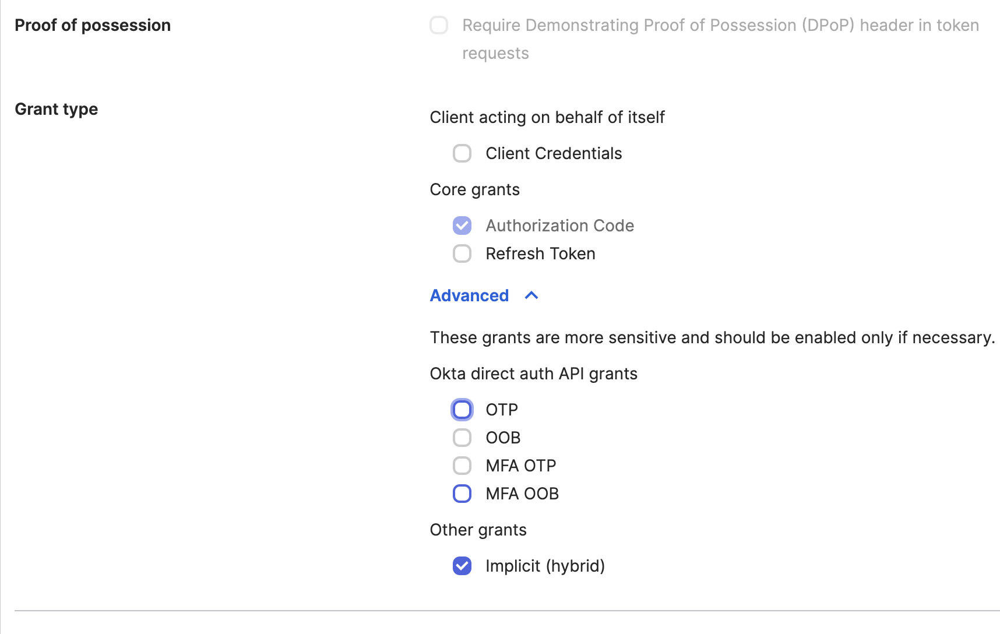
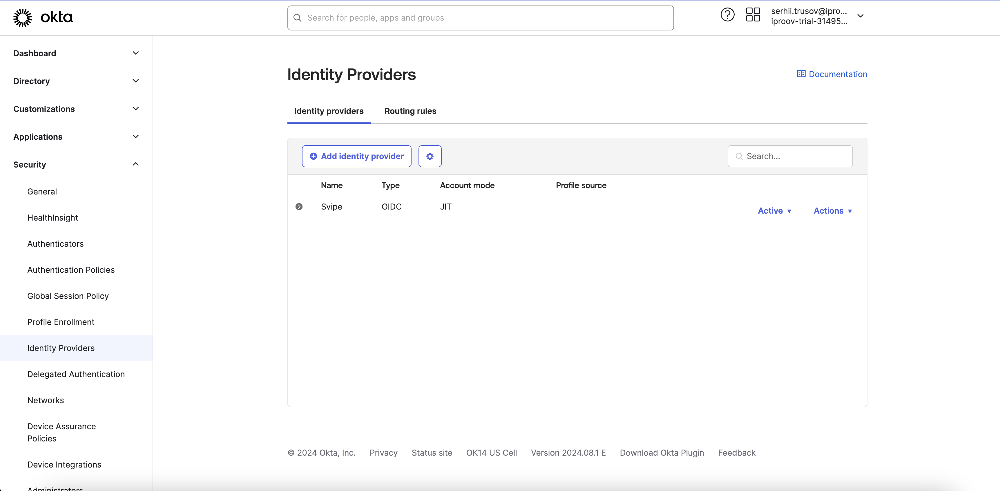
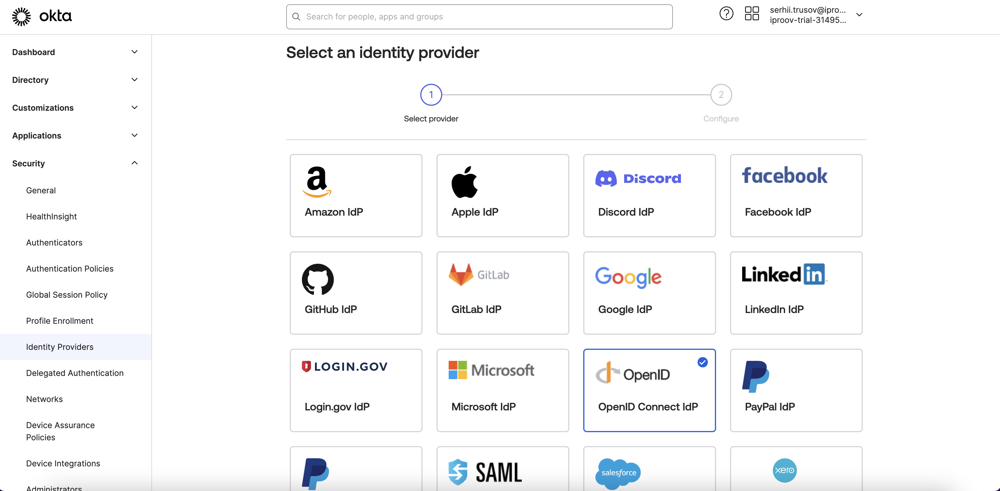
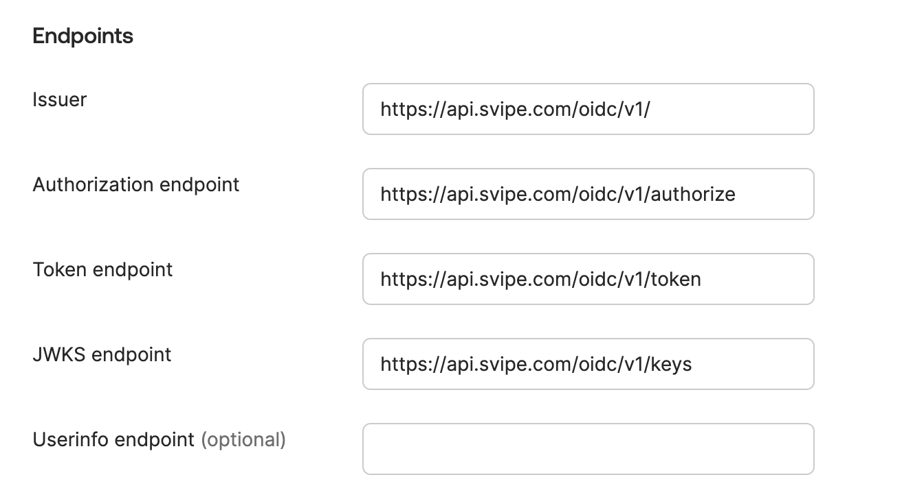
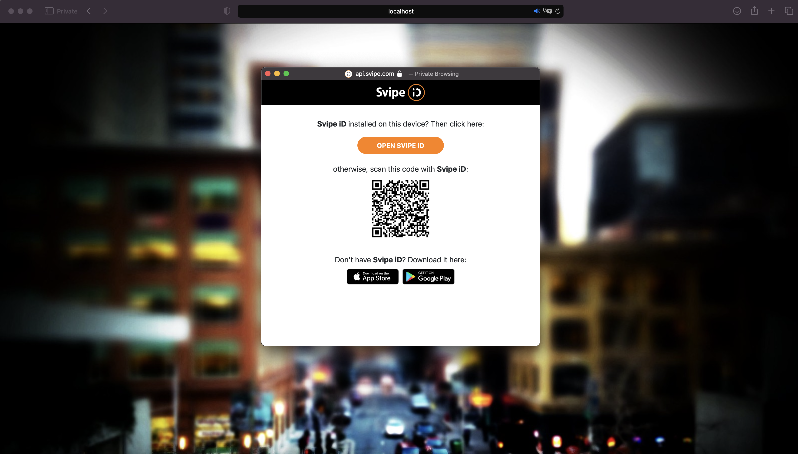
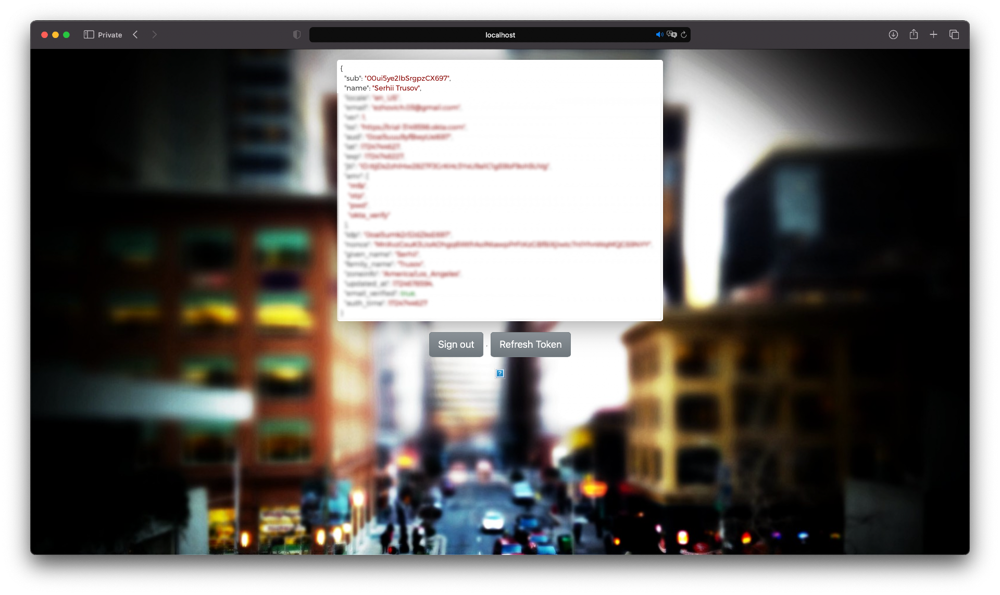

## Okta   <!-- {docsify-ignore} -->

Okta connects any person with any application on any device.

It's an enterprise-grade, identity management service, built for the cloud, but compatible with many on-premises applications. With Okta, IT can manage any employee's access to any application or device. Okta runs in the cloud, on a secure, reliable, extensively audited platform, which integrates deeply with on-premises applications, directories, and identity management systems.

## Set up An Okta Application

To try this integration, create a new application in Okta admin page. Go to Applications -> Applications then click on the Create App Integration button

Then configure the new app integration, select the OIDC as a Sign-in method and Single-page application for the Application type

And choose the Implicit (hybrid) in other grants field

## Create an Identity Provider

Create a new Identity Provider. To do this go to Security -> Identity providers then click on the Add Identity provider 

Choose Open ID Connect IdP as an Identity provider

Then fill in the Client ID and Client Secret that you got from the Svipe developer portal application.
And fill in the endpoints.

Update your config file with your Okta organization URL and the "Client ID" you copied from your Single Page OIDC Application.

When initializing the widget you then add the IdP as an additional param with the id and type (e.g. FACEBOOK, GOOGLE, or LINKEDIN) which controls the branding of the button.
And insert the IdP ID that you got from your Identity Provider in Okta.

    oktaSignIn.renderEl(
        {
          idps: [
            {
              type: 'type',
              id: 'xxxxxxxxxxxx'
            }
          ]
        }

Then open your web app and you should see the button for logging in. (in this case it's facebook branded, but you can customize that)

Press the Log in button and Launch the Svipe iD app, click on Scan QR and scan the Qr code on the login page:

Then you should be logged in

