## Wordpress   <!-- {docsify-ignore} -->

WordPress is a free and open-source content management system (CMS) that is used by over 40% of the top 10 million websites as of 2021. By integrating Wordpress with Svipe iD, reading or writing content can easily be restricted to verified users.

To try this integration using a local demo instance of wordpress, create a configuration file for docker named `docker-compose.yml` with the following content:

    version: '3.1'
    services:
      wordpress:
        image: wordpress
        ports:
          - 8080:80
        environment:
          WORDPRESS_DB_HOST:      db
          WORDPRESS_DB_NAME:      exampledb
          WORDPRESS_DB_USER:      exampleuser
          WORDPRESS_DB_PASSWORD:  examplepass
      db:
        image: mysql:5.7
        environment:
          MYSQL_DATABASE:         exampledb
          MYSQL_USER:             exampleuser
          MYSQL_PASSWORD:         examplepass
          MYSQL_RANDOM_ROOT_PASSWORD: '1'

Now launch wordpress with:

    docker compose -f docker-compose.yml up

Then launch a browser to http://localhost and start setting up the site by selecting your preferred language:

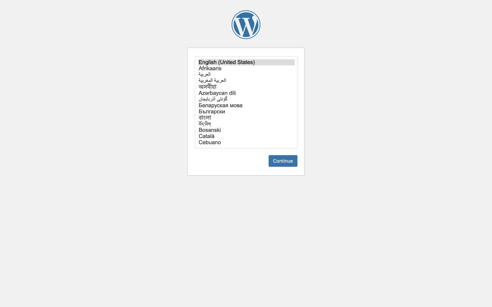

Configure the name of the site and the username and the password of the administrator and proceed by clicking on `Install WordPress`.

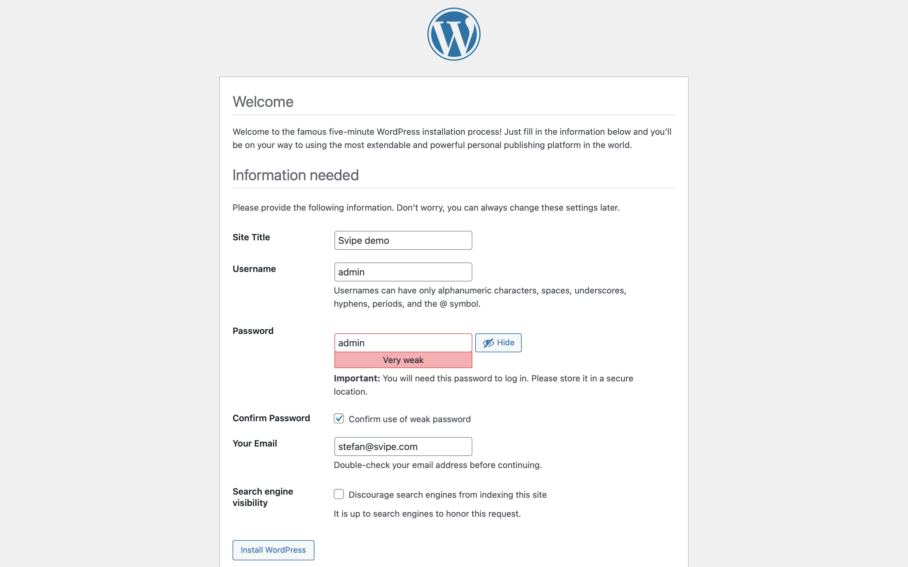

Your site is now up and running, so click `Log In` to proceed.

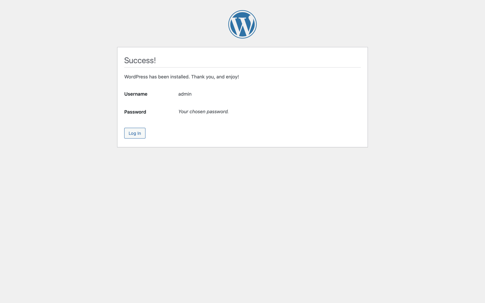

Enter the name and the password of the admin user that you just configured:

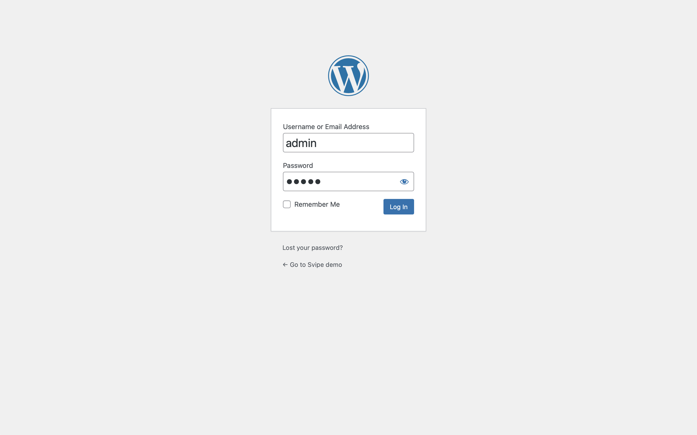
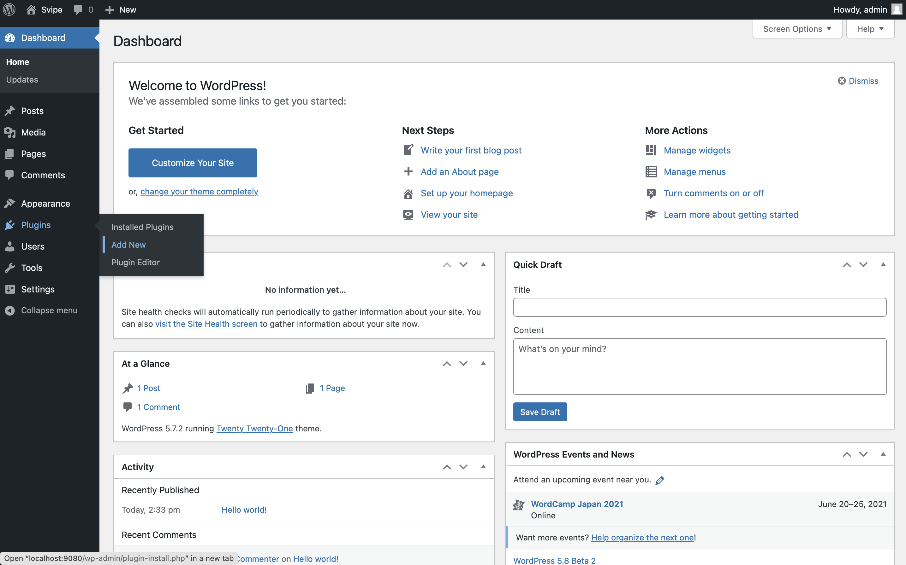
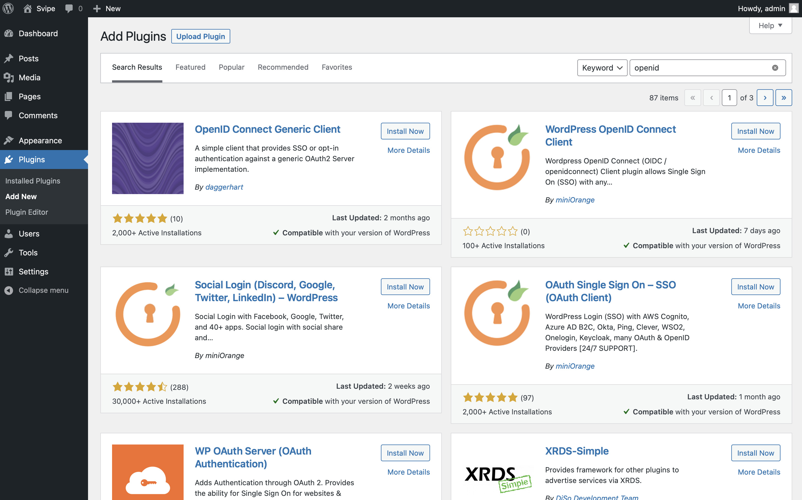
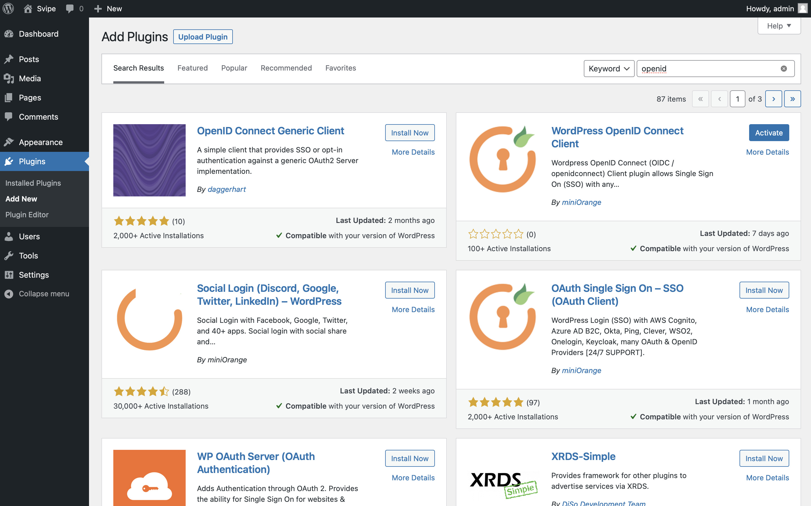
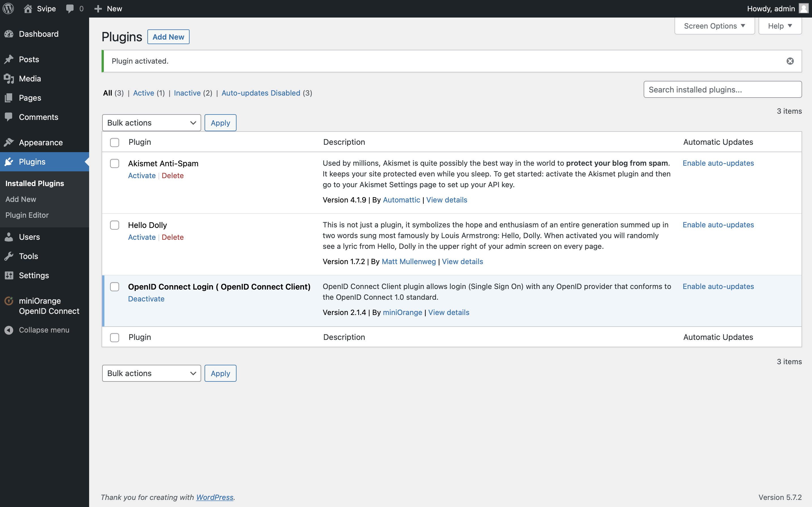
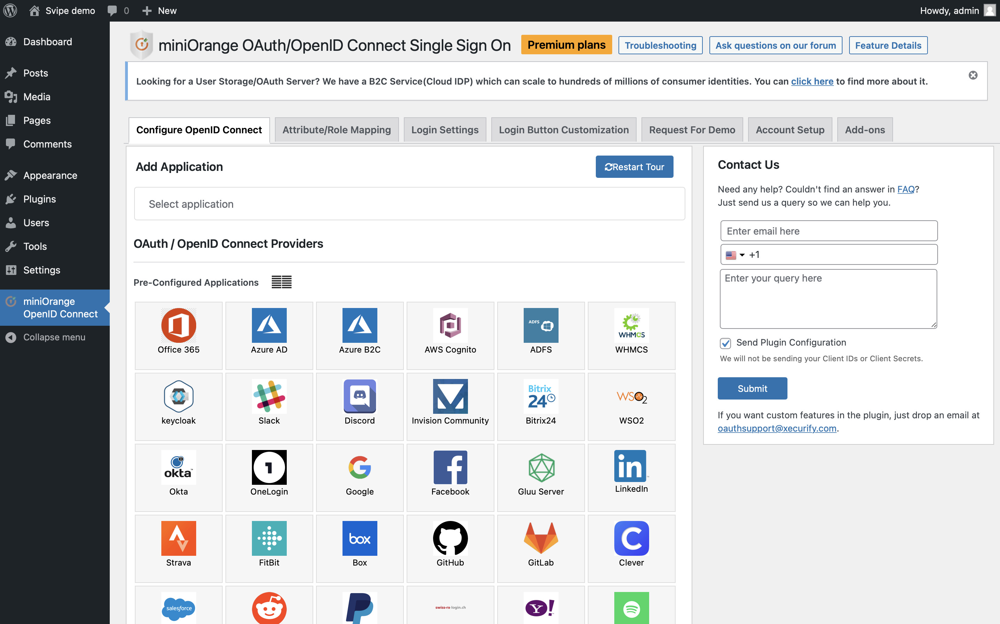
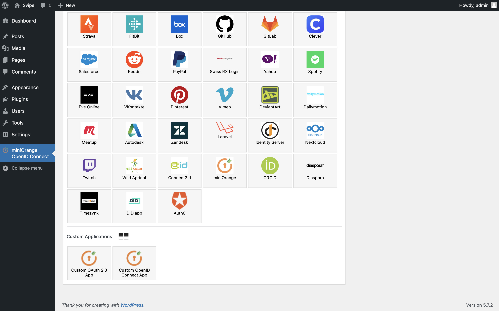
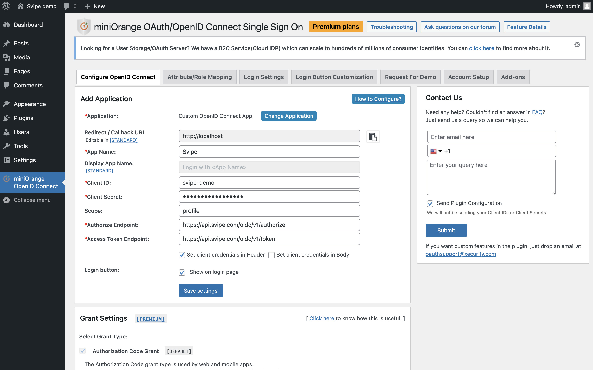
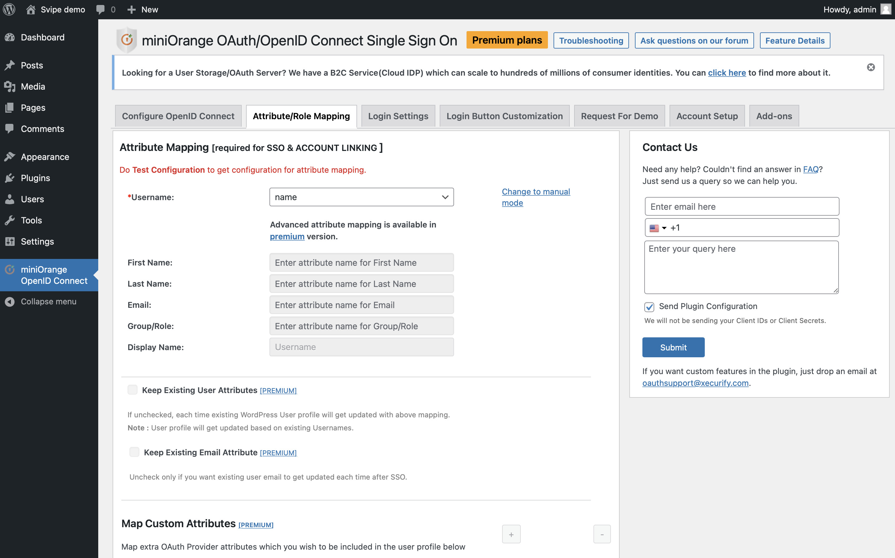
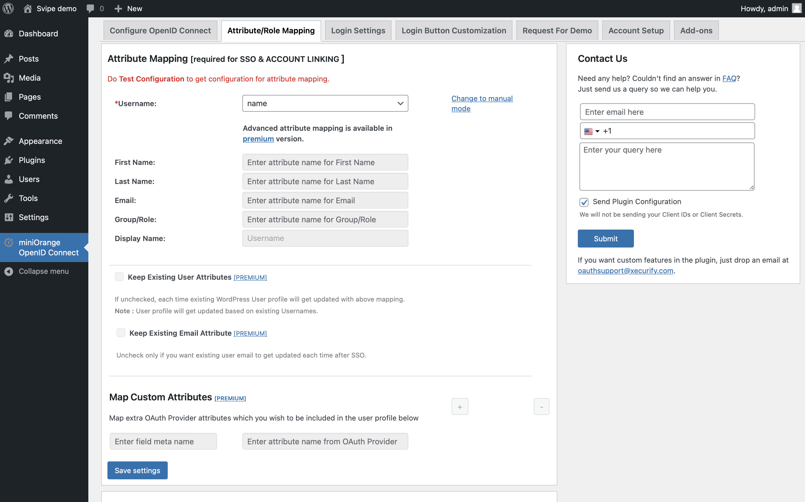

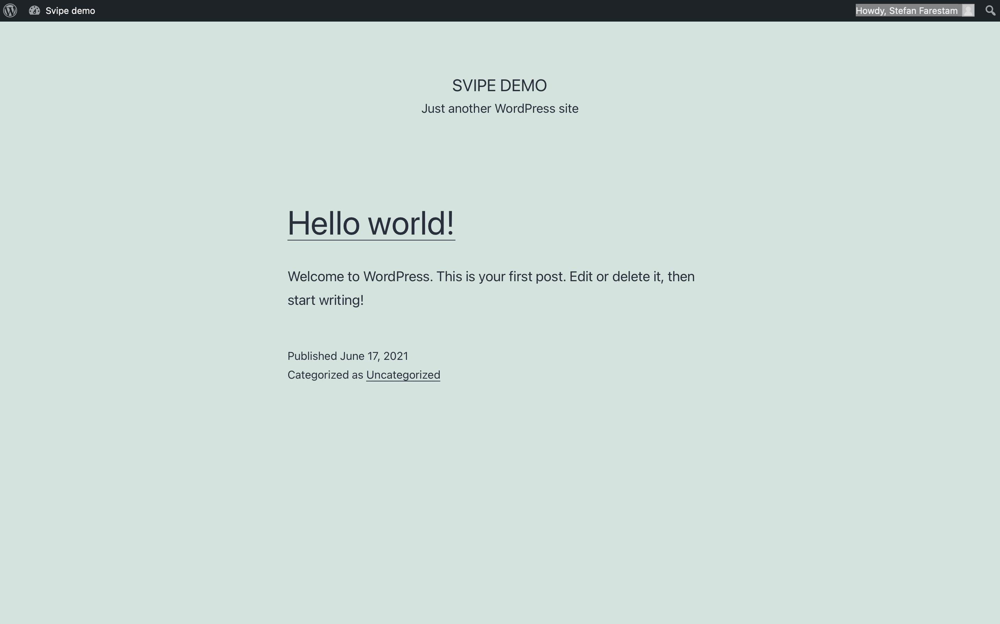

