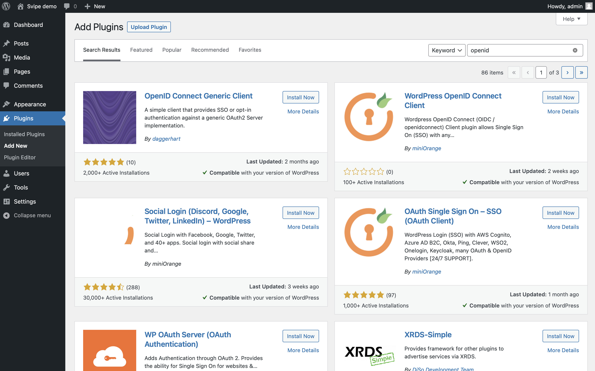
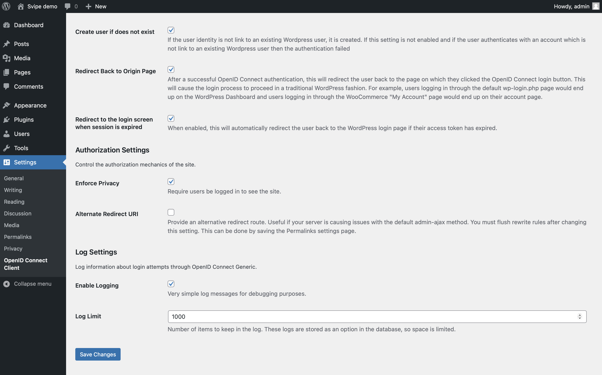
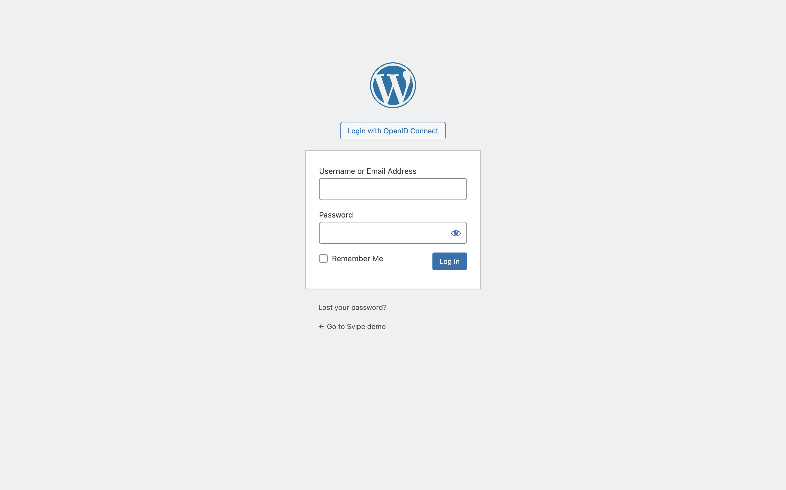

## WordPress   <!-- {docsify-ignore} -->

WordPress is a free and open-source content management system (CMS) that is used by over 40% of the top 10 million websites as of 2021. By integrating WordPress with Svipe iD, reading or writing content can easily be restricted to verified users.

## Set up WordPress

To try this integration using a local demo instance of WordPress, create a configuration file for docker named `docker-compose.yml` with the following content:

    version: '3.1'
    services:
      wordpress:
        image: wordpress:5.7.2
        ports:
          - 80:80
        environment:
          WORDPRESS_DB_HOST:      db
          WORDPRESS_DB_NAME:      exampledb
          WORDPRESS_DB_USER:      exampleuser
          WORDPRESS_DB_PASSWORD:  examplepass
      db:
        image: mysql:5.7
        environment:
          MYSQL_DATABASE:         exampledb
          MYSQL_USER:             exampleuser
          MYSQL_PASSWORD:         examplepass
          MYSQL_RANDOM_ROOT_PASSWORD: '1'

Now launch wordpress with:

    docker compose -f docker-compose.yml up

Then launch a browser to http://localhost and start setting up the site by selecting your preferred language:

Configure the name of the site and the username and the password of the administrator and proceed by clicking on `Install WordPress`.

Your site is now up and running, so click `Log In` to proceed.

Enter the name and the password of the admin user that you just configured and click `Log In`:

## Plugin: Generic Client

Our favourite OIDC plugin for WordPress is the open source plugin created by
[Tim Nolte](https://github.com/timnolte), which has a github repo [here](https://github.com/oidc-wp/openid-connect-generic). It integrates well with Svipe iD and has a nice option to require login to view any content. So if your aim is to require verified users to view your content, then this is your plugin.

To install it, select `Plugins -> Add New` in the left-side menu and search for `openid`. Then click on `Install Now` for the plugin named `OpenID Connect Generic Client`.

Then click on `Activate`:

You will now see a list of all installed plugins that should include your newly installed plugin. Click on `miniOrange OpenID Connect` in the left hand menu.

Click on `Settings ->  OpenID Connect Client` in the left-side menu:

Time to configure:

    Client ID:                      svipe-demo
    Client Secret Key:              svipe-demo-secret
    OpenID Scope:                   openid profile email
    Login Endpoint URL:             {{ oidc_root }}/authorize
    Userinfo Endpoint URL:          {{ oidc_root }}/userinfo
    Token Validation Endpoint URL:  {{ oidc_root }}/token

then scroll down and configure:

    End Session Endpoint URL:   svipe-demo
    Identity Key:               preferred_username
    Nickname Key:               preferred_username
    Email formatting:           {email}
    Display Name Formatting:    {given_name} {family_name}

Check:

    Create user if does not exist   [x]
    Redirect back to Origin Page    [x]

and check `Enforce Privacy` if you want to protect all access to the site with Svipe iD.

Check `Enable Logging` if you want to debug the login and then `Save Settings`.

Click on the user menu in the upper right-hand corner and select `Log Out`:

This will bring you the login screen and you now have the option to login with Svipe iD; click on `Login with OpenID Connect`:

Time to bring up the Svipe iD app again and scan the QR code:

and you should be logged in with your name from Svipe iD

## Plugin: miniOrange

To use the OpenID Connect plugin from miniOrange, select `Plugins -> Add New` in the left side menu:

Enter `openid` in the search field for plugins and click on `Install Now` for the plugin named `WordPress OpenID Connect Client` (created by `miniOrange`):

Now click on `Activate` on the same plugin:

You will now see a list of all installed plugins that should include your newly installed plugin. Click on `miniOrange OpenID Connect` in the left hand menu.

You will see a list of pre-configured OpenID Connect providers.

Scroll down all the way to the bottom and click on `Custom OpenID Connect App`.

Fill in the following information:

    App name:               Svipe
    Client ID:              svipe-demo
    Client Secret:          svipe-demo-secret
    Scope:                  profile
    Authorize Endpoint:     {{ oidc_root }}/authorize
    Access Token Endpoint:  {{ oidc_root }}/token

and then click on `Save settings`.

Add the value for the `User Info Endpoint` and click on `Test Configuration`

    User Info Endpoint:     {{ oidc_root }}/userinfo

Time to bring up the Svipe iD app and scan the QR code:

If everything is configured correctly, you will now see a list of identity information returned by Svipe iD:

Now, move to the tab for `Attribute/Role mapping` and select `name` as the mapping for `Username` and then `Save Settings`:

Click on the user menu in the upper right-hand corner and select `Log Out`:

This will bring you the login screen and you now have the option to login with Svipe iD; click on `Login with Svipe`:

Time to bring up the Svipe iD app again and scan the QR code:

and you should be logged in with your name from Svipe iD

