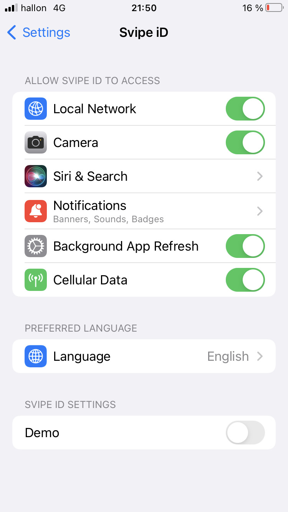
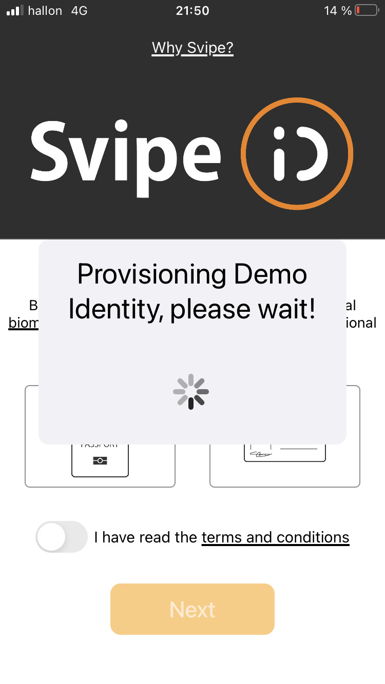
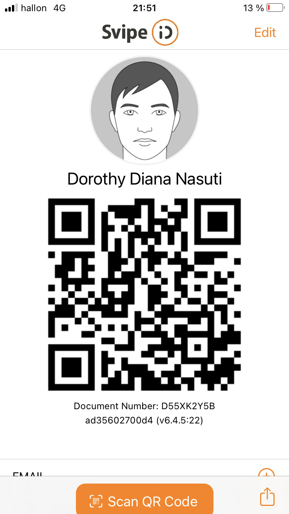
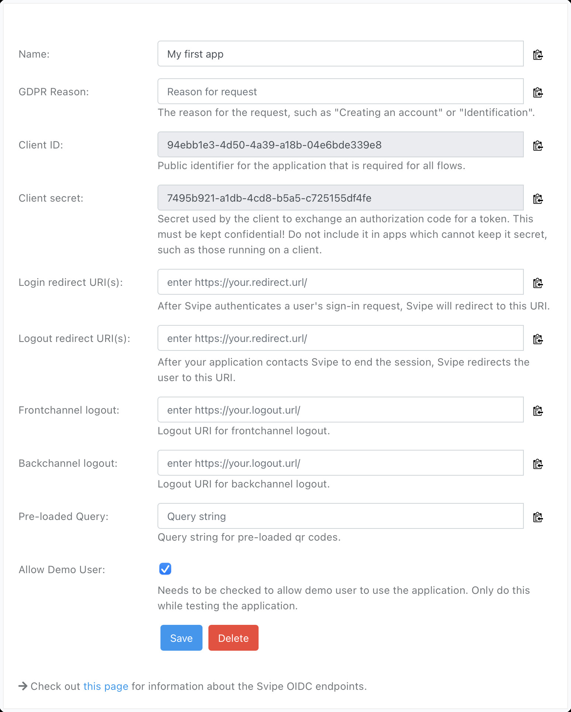

# Demo Identity

The Svipe iD app allows for provisioning a demo identity that can be used in a
similar fashion as a regular identity. However, the issuing country and the
nationality is set to be `UTO` (for Utopia), and is blocked for use in an OIDC
app unless it has been explicitly enabled.

## Provision a demo identity on iOS

Open Settings and search for Svipe:

click on `Svipe iD` and toggle the `Demo` setting:

then open the Svipe iD app and wait for the identity to be provisioned:

and after 10-15 seconds the demo identity becomes available and can be used as a
regular identitym if the site or app allows it:

## Configuring a demo identity for use

Demo identities can only be used with an oidc-app if they have been explicitly
allowed. However, the Svipe demo oidc credentials (svipe-demo/svipe-demo-secret)
will always allow them.

To enable:
* navigate to the [svipe developer portal](https://developer.svipe.com)
* login with your Svipe iD
* check the option "Allow Demo User"

