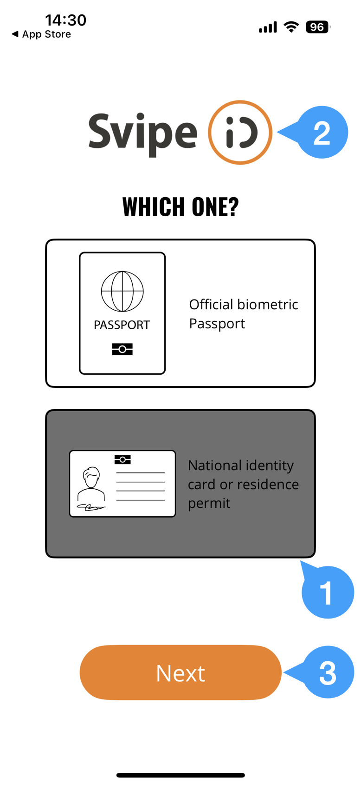

# Demo Identity

The Svipe iD app allows for provisioning a demo identity that can be used in a
similar fashion as a regular identity. However, the issuing country and the
nationality is set to be `UTO` (for Utopia), and is blocked for use in an OIDC
app unless it has been explicitly enabled.

Note that face and document reverification are not available in demo mode.

Also note that a new random demo identity will be generated each time, so a demo
identity can never be restored.

## Provision a demo identity on iOS

Start with a fresh installation of Svipe iD from the app store, so in case you
have it already installed, then you need to delete your currently installed
version and reinstall from the app store. Then start the app, approve the
terms and conditions and click `Next`:

Then, do the following:
1) Select a document type (it doesn't matter which one)
2) Click on the Svipe iD logo
3) Click `Next`

and after 10-15 seconds the demo identity becomes available and can be used as a
regular identity, if the site or app allows it:

To exit demo mode, delete the app or click the top right menu in the app (the
three dots) and then select `Delete document`. If you chose the latter option,
you can either create a new demo identity or verify an identity from an identity
document.

## Provision a demo identity on Android

Long press the SvipeID icon and select App Info

Scroll all the way down to `In-app notification settings`:

Select Demo mode

Activating demo mode will delete any identity currently registered in the app

The demo identity is being generated - it can 10-15 seconds.

The demo identity is now ready and can be used as a regular identity, if the
site or app allows it.

To exit demo mode, simply delete the demo identity from the [...] menu

## Configuring a demo identity for use

Demo identities can only be used with an oidc-app if they have been explicitly
allowed. However, the Svipe demo oidc credentials (svipe-demo/svipe-demo-secret)
will always allow them.

To enable:
* navigate to the [svipe developer portal](https://developer.svipe.com)
* login with your Svipe iD
* check the option "Allow Demo User"

