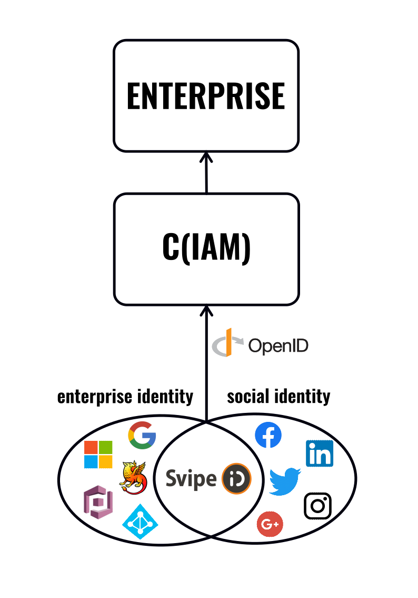

# Svipe as identity provider (IDP)

Svipe provides a powerful authentication solution that uses government-issued identification documents to link with any Identity and Access Management (IAM) system utilizing the OIDC (OpenID Connect) protocol. This system ensures strong authentication and verification of a person's identity, reducing the risk of unauthorized access to corporate or social media accounts.

With Svipe acting as an Identity Provider (IdP), enterprises can verify the actual person behind corporate or social media credentials. Using Svipe for employee enrolment also ensures the accuracy of input values, as the data is taken directly from a government-issued ID document. This enhances security by minimizing the risk of fraudulent input.

The use of Svipe eliminates the need for traditional passwords or insecure methods of information sharing. Managers no longer have to share secret information in risky ways such as using post-it notes or email. Svipe offers a simple and secure way to claim ID credentials.

