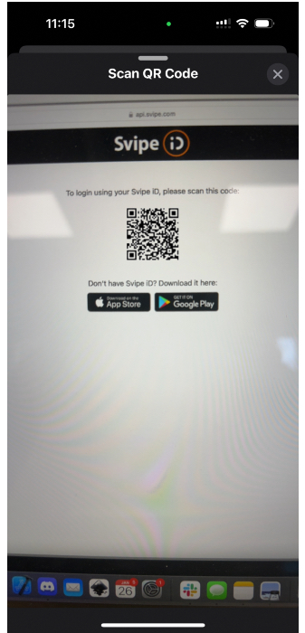

# Svipe for logging in
To use SvipeID as a secure and convenient way to log into online services, the first step is to [create a digital identity](onboarding.md) in the Svipe app. This digital identity is unique to the user and can be used as a means of authentication when logging in to online services.

When attempting to log in to a service, the user is prompted to select SvipeID as their login method. The user is then asked to scan a QR code provided by the service, which is used to verify their identity. This step ensures that the user is who they claim to be, and prevents unauthorized access to the service.

Once the QR code has been scanned and the user's identity has been verified, they are granted access to the service without the need for a traditional password. This process is not only more secure but also more convenient for the user, as they no longer have to remember multiple passwords for different online services.

Check out the our sample integrations for more:

[Netcloud](app-nextcloud.md)

[Mattermost](app-mattermost.md)

[Matrix](app-matrix.md)

[Keycloak](app-keycloak.md)

[Wordpress](app-wordpress.md)
