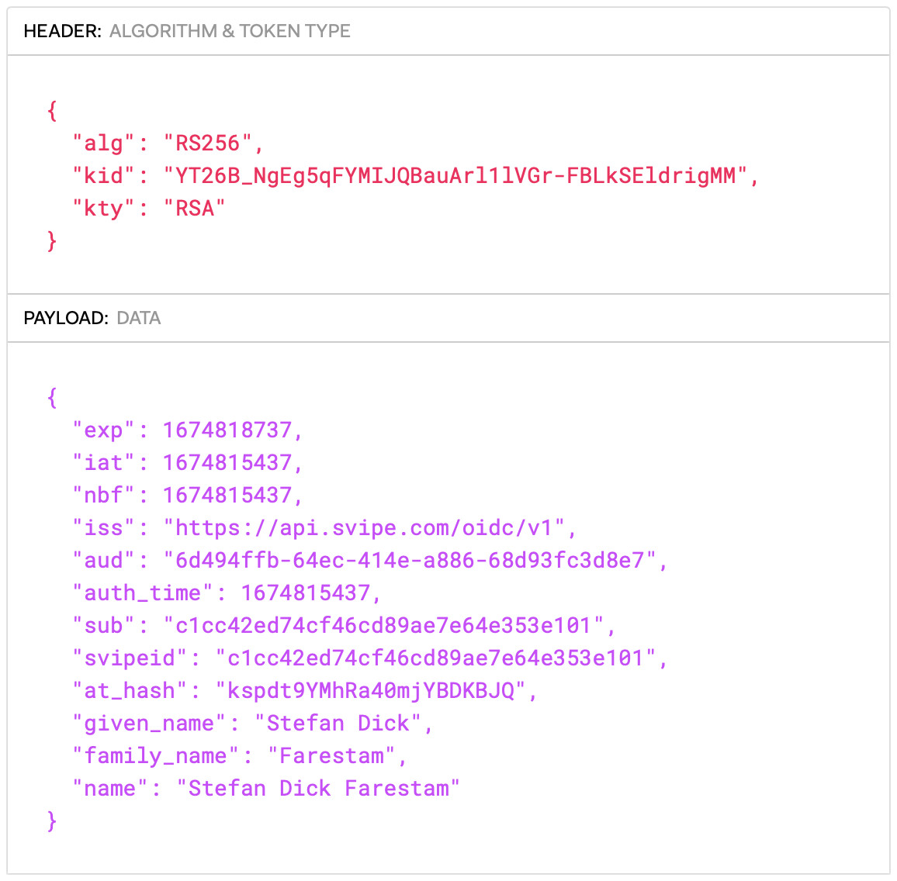

# OIDC Configuration

## OIDC endpoints

If your application supports dynamic discovery, then point it to:

    {{ oidc_root }}/.well-known/openid-configuration

Otherwise, enter the endpoints manually:

    authorization:  {{ oidc_root }}/authorize
    token:          {{ oidc_root }}/token
    revocation:     {{ oidc_root }}/token/revoke
    end session:    {{ oidc_root }}/logout
    userinfo:       {{ oidc_root }}/userinfo
    jwks:           {{ oidc_root }}/keys

## Client ID and Secret

For demo purposes you can use the following credentials:

    Client ID:      svipe-demo
    Client Secret:  svipe-demo-secret

To define your own custom applications, please visit [this page](/applications ":ignore").

# OIDC Scopes and Claims

## Scopes

The [OIDC
standard](https://openid.net/specs/openid-connect-core-1_0.html#ScopeClaims)
defines a set of standard scopes that can be used to request a set of claims.
Svipe supports all of the standard scopes, except the `address` scope. Note that
the claim values returned from the `profile` scope is quite limited as compared
to the standard (where `middle_name`, `nickname`, `preferred_username`,
`profile`, `picture`, `website`, `gender`, `birthdate`, `zoneinfo`, `locale`,
and `updated_at` are also included). 

| Scope       | Claims                                |
| :---------- | :------------------------------------ |
| openid      | svipeid                               |
| profile     | name, given_name, family_name         |
| age         | birthdate                             |
| gender      | gender                                |
| nationality | nationality                           |
| email       | email, email_verified                 |
| phone       | phone_number, phone_number_verified   |

We also offer two document-centric scopes, so that you can ask for all
information available from a document using a single scope identifier rather
than naming the individual claims.

| Scope         | Claims |
| :---          | :---
| document      | name,  given_name,  family_name,  gender,  birthdate,  com.svipe:svipeid,  com.svipe:document_nationality,  com.svipe:document_nationality_en,  com.svipe:document_type,  com.svipe:document_type_sdn,  com.svipe:document_type_sdn_en,  com.svipe:document_number,  com.svipe:document_issuing_country,  com.svipe:document_issuing_country_en,  com.svipe:document_expiry_date,  com.svipe:document_administrative_number
| document_full | same as `document` but also includes `com.svipe:document_portrait`

## Standard Claims

Svipe supports many, but not all, of the standard claims specified by the [OIDC standard](https://openid.net/specs/openid-connect-core-1_0.html#StandardClaims).

The following claims are derived directly from the identity document used to create the Svipe iD:

| Claim                 | Description       |
| :---                  | :---              |
| sub                   | A unique identifier for the user. Svipe returns the Svipe iD. |
| name                  | The full name.    |
| given_name            | Given name(s).    |
| family_name           | Last name(s).     |
| gender                | Gender, one of `male`, `female` or `unspecified` |
| birthdate             | Birthday, represented as an [ISO 8601](https://en.wikipedia.org/wiki/ISO_8601) compliant date. |

These claims can be added by the user and are verified by Svipe through a round-trip verification where the user proves the ownership:

| Claim                 | Description       |
| :---                  | :---              |
| email                 | E-mail address    |
| phone_number          | Telephone number in [E.164](https://en.wikipedia.org/wiki/E.164) compliant format. |

These claims are defined by the OIDC standard, to help differentiate between verified and unverified emails and phone numbers. However, Svipe always verify emails and phone numbers before they are allowed to be added, so these claims will always be true if they are present:

| Claim                 | Description                |
| :---                  | :---                       |
| email_verified        | Always **True** if present |
| phone_number_verified | Always **True** if present |

The following claims are preferences configured by the user or derived from system settings:

| Claim                 | Description       |
| :---                  | :---              |
| locale                | End-User's locale |

We currently do not support the following standard claims: `middle_name`,
`nickname`, `preferred_username`, `profile`, `picture`, `website`, `zoneinfo`,
`address`, and `updated_at`.

## Custom Claims

We also support the following non-standard claims, which are all derived from the identity document used to create the Svipe iD:

| Claim                                     | Description   |
| :---                                      | :---          |
| com.svipe:svipeid                         | Same as `sub` above. A globally unique identifier issued by Svipe to the user. Under normal conditions, a given person will retain the same Svipe ID even after renewing the underlying identity document. |
| com.svipe:document_portrait               | Photo from the document, provided as a [data url](https://en.wikipedia.org/wiki/Data_URI_scheme) in JPEG or JPEG2000 format.|
| com.svipe:document_nationality            | Nationality, provided in [ISO 3166-1 alpha-3 format](https://en.wikipedia.org/wiki/ISO_3166-1_alpha-3) |
| com.svipe:document_nationality_en         | The english name for the nationality |
| com.svipe:document_type                   | The raw version of the document type from the document. Note that the notation is not uniform across countries, so some countries may use `P` for a passport while others use `PN`. We recommend that you use `com.svipe:document_type_sdn` or `com.svipe:document_type_sdn_en` instead to build more reliable business logic |
| com.svipe:document_type_sdn               | The standardized version of the document type, which is one of `PN` (Passport), `PC` (Passport Card), `NID` National Identity Card) or `RP` (Residence Permit) |
| com.svipe:document_type_sdn_en            | The standardized version of the document type in english, which is one of `Passport`, `Passport Card`, `National Identity Card` or `Residence Permit` |
| com.svipe:document_number                 | The document number, as per the standard of the corresponding issuing country. This number is unique for the issuing country, but may not be unique globally and will change as the user renews the underlying identity document. |
| com.svipe:document_issuing_country        | Country that issued the document provided in [ISO 3166-1 alpha-3 format](https://en.wikipedia.org/wiki/ISO_3166-1_alpha-3) |
| com.svipe:document_issuing_country_en     | The english name for the country that issued the document |
| com.svipe:document_expiry_date            | Date of expiry for the document, represented as an [ISO 8601](https://en.wikipedia.org/wiki/ISO_8601) compliant date. |
| com.svipe:document_administrative_number  |  The national administrative number assigned to the individual. This could be a TID (Tax Identification Number) or any other national identifier such as a Swedish personal number. |

## Authentication Method

The OIDC standard describes a method to dictate the context of the
authentication called [ACR (Authentication Context Class
Reference)](https://openid.net/specs/openid-connect-core-1_0.html#acrSemantics).
ACR can either be specified with the `acr_values` request parameter or with the
`acr` claim for the id_token.

Svipe supports the following ACR values:

| Value                     | Description           |
| :------------------------ | :-------------------- |
| face_present              | The user is required to perform a biometric verification |
| document_present          | The user is required to verify the presence of the document used to create the Svipe iD with NFC |
| face_and_document_present | Both of the above     |

To request `face_precent`, either specify `acr` as an `id_token` claim:

    "claims": {
        "id_token": {
            "acr" : {
                "essential": true,
                "values": [
                    "face_precent"
                ]
            }
        }
    }

or in the `acr_values` request parameter:

    &acr_values=face_present

# CIBA - Client Initiated Backchannel Authentication

The CIBA flow enables a direct Relying Party to OpenID Provider communication, without redirects through the user's browser. It's therefore well suited to scenarios where the authentication is embedded in another context, such as a bot. See the [specification document](https://openid.net/specs/openid-client-initiated-backchannel-authentication-core-1_0-final.html) for more details.

## CIBA configuration in the developer portal

Create a new app in the Svipe Developer portal, enable CIBA and configure push delivery like this:

Note that the `Client notfication endpoint` needs to be a publicly available host that is reachable from the Svipe backend server. If you use a self-signed https server, then select `Self-signed endpoint` and the SSL certificate will not be verified.

In this example we have used a free service from [API Mocha](https://apimocha.com), which allows you to instantly create a free endpoint that accepts and displays an incoming http request.

## CIBA walkthrough with curl

Let's do a full authorization using the command line. Start by initiating a CIBA request (but replace the value for `client_id` with the one for the app that you configured in the developer portal):

    curl -X POST -d "client_notification_token=tokenXX&login_hint=authref&client_id=6d494ffb-64ec-414e-a886-68d93fc3d8e7&scope=profile"  https://api.svipe.com/oidc/v1/authorize_ciba

This call will return:

    {
        "auth_req_id": "CzLMlkHCwHjsX737FOh5f851xj68htetwtkfyuOj",
        "expires_in": 1800,
        "interval": 5,
        "authref": {
            "qrlink": "https://app.svipe.com/a/jmyMx12rjgbwLA",
            "qrcode": "https://api.svipe.com/oidc/v1/qr/jmyMx12rjgbwLA.png",
            "applink": "https://app.svipe.com/a/jmyMx12rjgbwLA?ondevice",
            "qrauth": "https://api.svipe.com/oidc/v1/qrauth/jmyMx12rjgbwLA?ondevice",
            "expires_in": 1799,
            "expires_at": 1674817214
        }
    }

`auth_req_id` is the request id for the response and will be included in the response to the notification url.

`authref` is returned when the value of the `login_hint` paramater to the initial call to `authorize_ciba` is `authref`, and contains information that will help you to either build or use a pre-generated qrcode that you display to the user:

| Value      | Description |
| :--------- | :---------- |
| qrlink     | The link in the QR code. This is useful if you are using your own library to build the QR code. |
| qrcode     | If instead you want an image link to a generated QR code, then use this value. The link supports the extra query parameters `scale`, `module_color` and `background` to further define the size of the QR code and the colors used in it. The default value for `scale` is 3.  `module_color` and `background` colors are given as RGB colors. A sample query could be `?scale=3&module_color=000000&background=FFFFFF`.
| applink    | The link used in a button to trigger Svipe iD when used on a mobile device, as in this case the QR code can't be read. |
| qrauth     | The link to the authorization page created by Svipe, which in turns display the qrcode. |
| expires_in | The validity (in seconds) of the QR code. |
| expires_at | The UTC timestamp in seconds when the QR code will expire. |

Now, open a browser with the url returned in the returned qrcode field, scan the qrcode with the Svipe and approve the request.

Here's a one-liner that will open the qrcode in a browser on macOS (but it requires the JSON parser `jq` which can be installed with `brew`):

    curl -s -X POST -d "client_notification_token=tokenXX&login_hint=authref&client_id=6d494ffb-64ec-414e-a886-68d93fc3d8e7&scope=profile"  https://api.svipe.com/oidc/v1/authorize_ciba | jq -r .authref.qrcode | xargs open

When the request has been approved in the app, you will see the incoming http post to the endpoint that you created:

The id_token is a signed JWT (use [jwt.io](https://jwt.io) to view) and contains a body with the result of the authentication request:

Note that the incoming request has an authorization header that includes the bearer token that you used in the first request. Also, the JSON body contains the `auth_req_id` that was returned by the first call.

As you can see, the CIBA flow is very simple and well suited for a non-browser-based authentication. You only need to manage the display of the qrcode.

## Sample script for pull-based CIBA

An alternative to using CIBA in `push` mode, is to query the Svipe backend continuously using CIBA `pull` mode. While less immediate and more resource-intense, it does have the advantage that you don't need a publicly available endpoint, so it's very easy to get started.

To show how this can be done, we've create a
[sample bash script](https://github.com/svipe/svipe-oidc-rp-samples/blob/main/3_CIBA/test_ciba.bash). To use it, you only need to register an app in the Svipe Developer Portal and enable it for CIBA.

# Other features

## Backchannel logout

Svipe supports the new [backchannel
logout](https://openid.net/specs/openid-connect-backchannel-1_0.html) protocol.
The backchannel logout URL is specified in the [applications
section](https://developer.svipe.com/applications) of the Svipe developer
portal.

## Frontchannel logout

Svipe supports the forthcoming [frontchannel
logout](https://openid.net/specs/openid-connect-frontchannel-1_0-06.html) protocol.
The frontchannel logout URL is specified in the [applications
section](https://developer.svipe.com/applications) of the Svipe developer
portal.

# Special features

## Pre-loaded QR-codes

To facilitate integration of Svipe iD, and to reduce the size of QR-codes, we
have added support for pre-defining query-parameters for QR-codes in our admin
interface. The parameters are defined for each application in the [Svipe
developer portal](http://developer.dev.bes.svipeid.com/applications) in the
section `Pre-loaded Query`:

The QR-code can then be created entirely client-side and must contain the
following parameters separated by the dot (`.`) character:

* `client_id`
* `state`
* `nonce`

If PKCE is used (which we recommend), then those parameters also need to be added:

* `code_challenge`
* `code_challenge_method`

Sample QR-codes using the `svipe-demo` client_id (`state` and `nonce` kept short for clarity):

| Variant | QR-code |
| :---    | :---    |
| Regular | app.svipe.com/a/svipe-demo.M5Nv1.zPPik |
| PKCE    | app.svipe.com/a/svipe-demo.M5Nv1.zPPik.7yUKf4oSfO-4IqWG36xlE0P7N9SdO1gObCc10uUFlvc.S256 |

All other parameters needs to be added in the admin interface.

Since the QR-code is scanned by the user with the Svipe iD-app, the
page needs to communicate with the svipe oidc-backed so that it gets notified
when the user has scanned the code and approved the sharing of information. This
is done using a socketio connection to api.svipe.com.

To make this more clear, we have provided [sample code in python on
github](https://github.com/svipe/svipe-oidc-rp-samples) for an RP that uses
pre-loaded QR-codes to login. More information in the
[Readme](https://github.com/svipe/svipe-oidc-rp-samples/blob/main/README.md)
file and the specic code in the
[2_Auth_Flow_Preloaded_Qrcode](https://github.com/svipe/svipe-oidc-rp-samples/tree/main/2_Auth_Flow_Preloaded_Qrcode)
subdirectory

## Custom QR code display

If the value for `display` in the call to authorize is `authref`, then a number
of values are returned to facilitate the building of a custom QR code page.

| Value      | Description |
| :--------- | :---------- |
| qrlink     | The link in the QR code. This is useful if you are using your own library to build the QR code. |
| qrcode     | If instead you want an image link to a generated QR code, then use this value. The link supports the extra query parameters `scale`, `module_color` and `background` to further define the size of the QR code and the colors used in it. The default value for `scale` is 3.  `module_color` and `background` colors are given as RGB colors. A sample query could be `?scale=3&module_color=000000&background=FFFFFF`.
| applink    | The link used in a button to trigger Svipe iD when used on a mobile device, as in this case the QR code can't be read. |
| qrauth     | The link to the authorization page created by Svipe, which in turns display the qrcode. |
| expires_in | The validity (in seconds) of the QR code. |
| expires_at | The UTC timestamp in seconds when the QR code will expire. |
| session    | The OIDC session identifier which is used in the registration call to socketio |
| server     | The server that should be used for connecting using socketio |

## Test Documents

Svipe supports the use of test documents, to test Oidc integrations. To trigger the use of a test document, rather than a real user authentication, the value of the oidc parameter `login_hint` needs to be set to one of the following supported test documents: 

| login_hint         |  |  |
| ------------------ | ------------- | ------------ |
| test:prado:SWE-AO-05001 | [Document info](https://www.consilium.europa.eu/prado/en/SWE-AO-05001/index.html) | [Biodata page](https://www.consilium.europa.eu/prado/en/SWE-AO-05001/image-353599.html) |
| test:prado:SWE-AO-04001 | [Document info](https://www.consilium.europa.eu/prado/en/SWE-AO-04001/index.html) | [Biodata page](https://www.consilium.europa.eu/prado/en/SWE-AO-04001/image-276079.html) |
| test:prado:GBR-AO-06001 | [Document info](https://www.consilium.europa.eu/prado/en/GBR-AO-06001/index.html) | [Biodata page](https://www.consilium.europa.eu/prado/en/GBR-AO-06001/image-325927.html) |
| test:prado:FRA-AO-03004 | [Document info](https://www.consilium.europa.eu/prado/en/FRA-AO-03004/index.html) | [Biodata page](https://www.consilium.europa.eu/prado/en/FRA-AO-03004/image-310115.html) |
| test:prado:THA-AO-06001 | [Document info](https://www.consilium.europa.eu/prado/en/THA-AO-06001/index.html) | [Biodata page](https://www.consilium.europa.eu/prado/en/THA-AO-06001/image-346256.html) |
| test:prado:USA-AO-05001 | [Document info](https://www.consilium.europa.eu/prado/en/USA-AO-05001/index.html) | [Biodata page](https://www.consilium.europa.eu/prado/en/USA-AO-05001/image-336996.html) |

These test documents were collected from the sites of the national police authories in each country and are named in accordance to the scheme used in [Prado](https://www.consilium.europa.eu/prado/en/search-by-document-country.html), where more details can be found for each document.

If the scope `email` is used, then a sample email is created using the first and the last name. Similarly, the scope `phone` creates a sample phone number using the country code of the issuing country and in a format complying to phone numbers used in that country.

We have provided a sample bash script that showcases the usage and uses curl. It can be found [here](https://github.com/svipe/svipe-oidc-test-docs).

A sample of the userinfo returned for `test:prado:SWE-AO-05001`, when the scope `document phone email` was used:

    {
        "sub": "0d320267183d183554aa00a546d130dd",
        "name": "Svea Specimen",
        "given_name": "Svea",
        "family_name": "Specimen",
        "gender": "female",
        "birthdate": "1982-08-21",
        "email": "svea.specimen@no-such-domain.com",
        "email_verified": true,
        "phone_number": "+468123456",
        "phone_number_verified": true,
        "com.svipe:document_type": "P",
        "com.svipe:document_type_sdn": "PN",
        "com.svipe:document_type_sdn_en": "Passport",
        "com.svipe:document_issuing_country": "SWE",
        "com.svipe:document_issuing_country_en": "Sweden",
        "com.svipe:document_nationality": "SWE",
        "com.svipe:document_nationality_en": "Sweden",
        "com.svipe:document_administrative_number": "198208212384",
        "com.svipe:document_number": "XA0000001",
        "com.svipe:document_expiry_date": "2027-01-01",
        "com.svipe:svipeid": "0d320267183d183554aa00a546d130dd",
        "com.svipe:meta_transaction_id": "AYZAJepa.pU9d4yIK_Y5HsW_cULBhUCzulJ56boQF38SGZMpR"
    }
