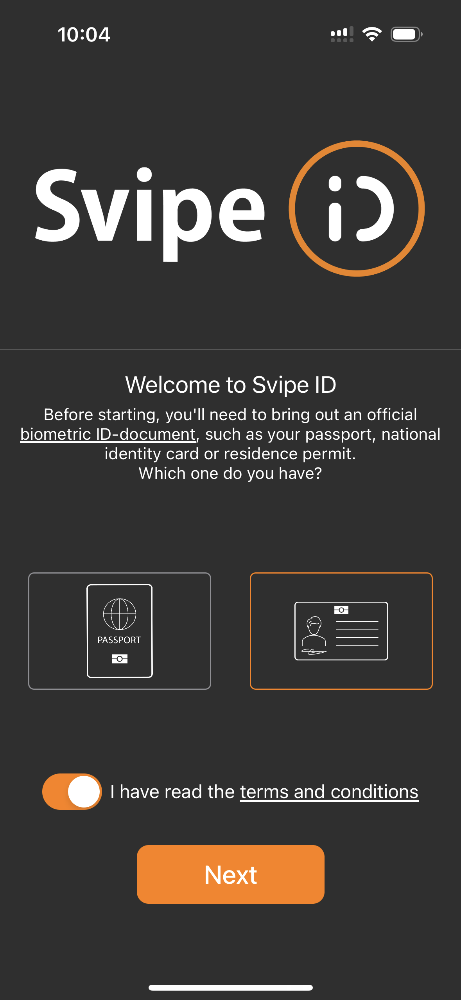

# Onboarding

The first thing the user needs to do is to onboard using the svipe app, their biometric ID-document and their face.

## Step 1 - Download the SvipeID app

As soon as users download and open the app, they see the welcoming page. Here they need to choose which document they want to use. After this, they need to accept the terms and conditions and press the "Next" button.

## Step 2 - Scanning the MRZ

Now, user needs to scan the MRZ (Machine-Readable Zone) with their phone. They just point the camera at the code on their document and the app will do the rest

## Step 3 - Scanning the NFC

The next step is scanning the biometric chip inside the document. By placing the document against the back of the phone the reading is initiated. If it's not starting, slide it slowly until it vibrates, then keep still.\

Here is a video explanation of scanning the biometric chip:

## Step 4 - Face Verification

Next step is face verification to prove possession of the document. The user places their phone on  eye level, blinks and smiles.

Here is a video explanation of face verification:

## Step 5 - Done!

Now the user has done their part, the back-end is validating all the collected data and creating verifiable identity credentials, which are sent to the user's phone.

What makes Svipe special, is that the back-end is then deleting all data in clear, this leaves the user in full control of their own data and whom they shares it with.
