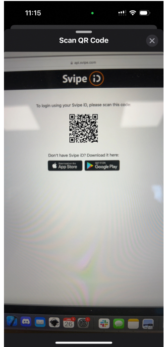

# Sharing the data
Now, when the onboarding is done, and the identity data is securely stored on the user's handset, data can be shared. Sharing of identity data is done with the full concent and complete transparency for the user. Each sharing requires the user to specificly consent to a logo, a company name and a GDPR reason. The sharing can either be used to verify the user for example, during an account creation, to log in to pages without password or as a step-up authentication.

## Scan QR-code or click link
The QR-code is created by the Relying party to ask for specific claims. The Relying party can set choose mandatory or optional claims.

## Consent approval

The user is presented with a screen showing the logo, the name of the RP and the GDPR-reason for sharing data.

As demonstrated in the picture the user can choose to exclude non-mandatory claims.

<!--
## Audit logs

Each approval is in fact an electronically signed proof stored in the Svipe backend and made availalbe to RP via API's
-->